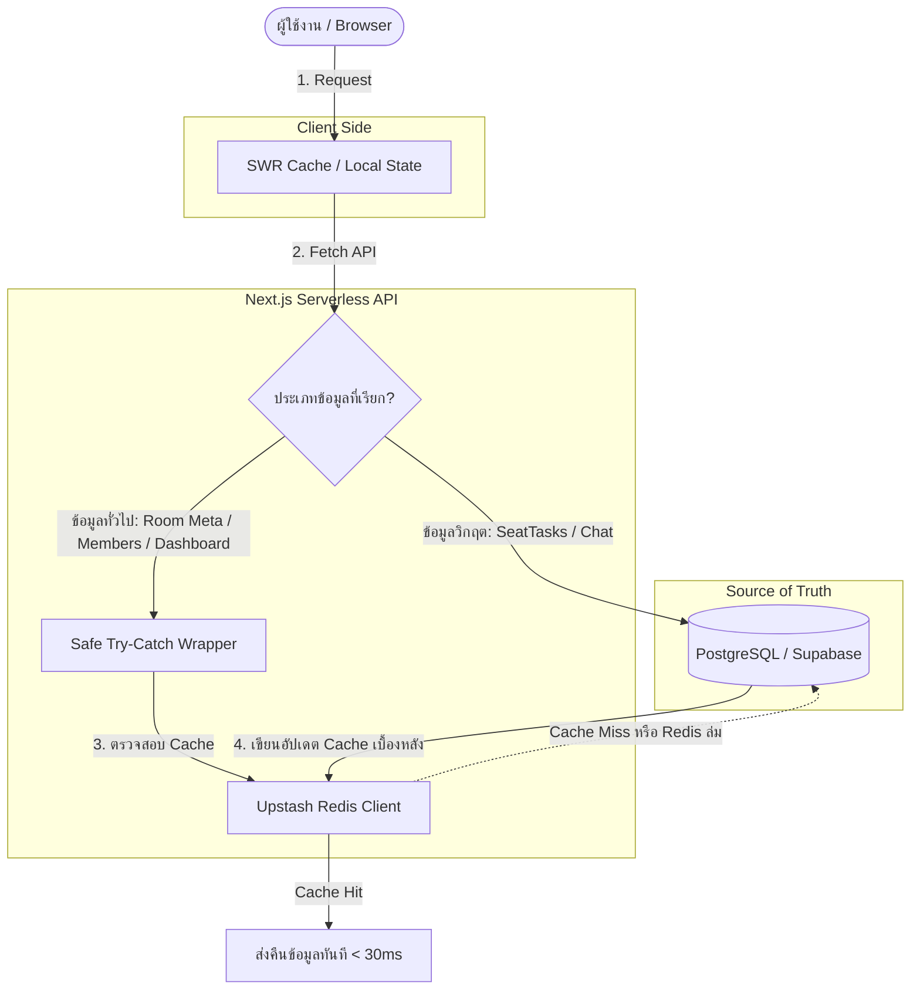

# 🎟️ TicketWar Caching Architecture & Strategy Plan

เอกสารสรุปผลการวิเคราะห์สถาปัตยกรรมระบบแคช (Caching Architecture) จาก **Grill-me Session** สำหรับแพลตฟอร์ม **TicketWar**

---

## 1. Executive Summary & Design Decisions

| หัวข้อ | มติจากการวิเคราะห์เชิงลึก | เหตุผลและผลกระทบทางเทคนิค |
| :--- | :--- | :--- |
| **เป้าหมายหลัก** | 1. รองรับ Concurrency Spike ช่วงรุมกดบัตร<br>2. เร่งความเร็ว Dashboard & Room Detail<br>3. ลดภาระ Query/Connection บน PostgreSQL | ป้องกันปัญหา Database Connection Pool เต็ม และลด TTFB (Time to First Byte) ให้เหลือระดับเสี้ยววินาที |
| **ขอบเขตการแคช (Cache Boundary)** | **แบ่งแยกระดับข้อมูลอย่างเด็ดขาด**: <br>• 🚫 **ห้ามแคช (Zero-Cache)**: `SeatTasks` (สถานะที่นั่ง, คนที่กดได้, รายการรอจ่าย) และ `Live Chat`<br>• ✅ **แคชได้ (Cacheable)**: ข้อมูลห้อง (Metadata, ชื่อ, รายละเอียด, รูปผังที่นั่ง, โปสเตอร์), ข้อมูลสมาชิกในห้อง (`Room Members`), ข้อมูลผู้ใช้, สรุปห้องในหน้า Dashboard | ป้องกันข้อผิดพลาด **Stale Data** ที่ร้ายแรงที่สุดในระบบกดบัตร เช่น เข้าใจผิดว่ายังมีที่นั่งว่าง หรือสองคนพยายามจ่ายเงินสำหรับที่นั่งเดียวกัน |
| **ระบบ Infrastructure** | **External Redis ผ่าน `@upstash/redis` (REST/HTTP-based)** | ใช้ HTTP Stateless connection แทน TCP connection pool แบบเดิม เข้ากันได้สมบูรณ์กับ Serverless Runtime (Next.js บน Vercel) โดยไม่เกิดปัญหา Connection Exhaustion |
| **กลยุทธ์ TTL & Key** | • `room:{id}:meta` (TTL 5–10 นาที + Active Invalidation เมื่อแก้ห้อง)<br>• `room:{id}:members` (TTL 10 นาที + Active Invalidation เมื่อ Join/Kick/Leave/Accept)<br>• `dashboard:{userId}:{paramsHash}` (Short TTL 30–60 วินาที) | ลดความซับซ้อนของการจัดการ Invalidation หลีกเลี่ยงแคชค้างข้ามวัน |
| **การจัดการเมื่อระบบล่ม (Resilience)** | **Fail-Open (Graceful Fallback)** | หาก Redis ล่ม, Timeout, หรือ Token เกินโควตา ระบบจะ Fallback วิ่งเข้า PostgreSQL อัตโนมัติ โดยที่ User จะไม่พบข้อผิดพลาด 500 |

---

## 2. แผนภาพการไหลของข้อมูล (Data Flow Architecture)



---

## 3. แผนการดำเนินงานเป็นลำดับขั้น (Phase-by-Phase Implementation)

### 📌 Phase 1: Infrastructure & Core Redis Module
1. **ติดตั้ง Dependency**:
   ```bash
   cd web
   npm install @upstash/redis
   ```
2. **ตั้งค่า Environment Variables** ใน `.env` และ `.env.example`:
   ```env
   UPSTASH_REDIS_REST_URL="https://your-upstash-instance.upstash.io"
   UPSTASH_REDIS_REST_TOKEN="your-upstash-token"
   ```
3. **สร้าง Safe Redis Wrapper** (`web/src/lib/redis.ts`):
   - Wrap คำสั่ง `get`, `setex`, `del` ด้วย `try-catch` แบบ **Fail-Open**
   - พัฒนา Helper Functions สำหรับสร้าง Cache Key เช่น:
     - `getRoomMetaKey(roomId: string)`
     - `getRoomMembersKey(roomId: string)`
     - `getDashboardKey(userId: string, filterHash: string)`

---

### 📌 Phase 2: Room Metadata & Members Caching & Invalidation
1. **Room Metadata (`room:{id}:meta`)**:
   - **Read Path** (`GET /api/rooms/[id]`):
     - ดึงข้อมูล `room:{id}:meta` จาก Redis ก่อน
     - หากพบข้อมูล (Cache Hit): รวมข้อมูล Metadata เข้ากับ `SeatTasks` และ `Messages` ที่ดึงสดจาก DB
     - หากไม่พบข้อมูล (Cache Miss): Query DB ตามปกติแล้ว Set ลง Redis พร้อม TTL 5 นาที
   - **Invalidation Path**:
     - เมื่อมีการบันทึกการแก้ไขห้อง (`PATCH /api/rooms/[id]`) หรือเปลี่ยนสถานะ (`PATCH /api/rooms/[id]/status`) ให้เรียกคำสั่ง `redis.del(getRoomMetaKey(roomId))` ทันที

2. **Room Members (`room:{id}:members`)**:
   - **Read Path** (`GET /api/rooms/[id]/members`):
     - ดึงข้อมูล `room:{id}:members` จาก Redis ก่อน (TTL 10 นาที) เพื่อให้การเปิด Modal รายชื่อสมาชิกแสดงผลทันที (< 30ms) ไม่ต้องรอ JOIN ตารางใน DB
     - หากไม่พบข้อมูล (Cache Miss): Query DB ตามปกติแล้ว Set ลง Redis
   - **Invalidation Path** (ลบแคชทันทีที่มีการเปลี่ยนแปลงสมาชิก):
     - เมื่อมีคนกดจอยห้องผ่านรหัส: `POST /api/rooms/join`
     - เมื่อหัวห้องเตะสมาชิก หรือสมาชิกกดออกจากห้องเอง: `DELETE /api/rooms/[id]/members`
     - เมื่อมีคนกดยอมรับคำเชิญเข้าห้อง: `PATCH /api/invitations/[id]` (สถานะ ACCEPTED)

---

### 📌 Phase 3: Dashboard Route Caching (Short-TTL)
1. **Read Path** (`GET /api/rooms`):
   - รวม Parameters ทั้งหมด (`userId`, `page`, `limit`, `tab`, `status`, `dateFilter`, `search`) เพื่อสร้าง Hash Key
   - กำหนด TTL สั้น (30–60 วินาที)
   - ช่วยลดภาระการรัน `count()` 4 Queries ซ้ำซ้อนใน `Promise.all` เมื่อผู้ใช้งานรีเฟรชหน้าบ่อยครั้ง
2. **Invalidation Path**:
   - เมื่อผู้ใช้งานสร้างห้องใหม่ (`POST /api/rooms`) ให้ Invalidate แคชของ Dashboard ประจำตัวผู้ใช้นั้น

---

### 📌 Phase 4: Verification & Performance Benchmark
1. **Cache Hit Verification**:
   - วัดเวลา Response Time ของ API เปรียบเทียบระหว่างก่อนและหลังเปิดใช้งานแคช
2. **Fail-Open Resilience Test**:
   - ทดสอบจำลองกรณีปิดการเชื่อมต่อ Redis หรือใส่ Token ผิด เพื่อตรวจสอบว่าระบบยังคงอ่าน-เขียนฐานข้อมูล PostgreSQL ได้ราบรื่น 100%
3. **Real-time Accuracy Check**:
   - ทดสอบจำลองหลายผู้ใช้ในห้องเดียวกัน อัปเดตภารกิจที่นั่งและส่งข้อความแชท ตรวจสอบว่าไม่มีอาการ Stale Data ขัดขวางการทำงาน
