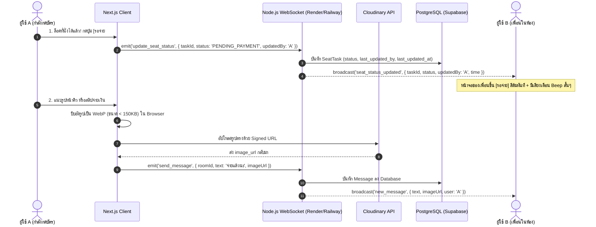

# พิมพ์เขียวสถาปัตยกรรมระบบ: TicketWar & Live Seat Tracker

> **Design Theme:** Spotify-Inspired Content-First Darkness (`#121212` / `#181818`), Pill Geometry & Tactile Shadows (ตามสเปกใน [`GESIGN.md`](file:///c:/D/task/GESIGN.md))

---

## 1. คลังรูปภาพต้นแบบ UI ทั้งหมด (All Prototype Gallery)

รูปภาพความละเอียดสูงทั้งหมดถูกคัดลอกและบันทึกไว้ในโฟลเดอร์ [`prototypes/`](file:///c:/D/task/prototypes) ในเครื่องของคุณเรียบร้อยแล้ว:

```carousel

<!-- slide -->

<!-- slide -->

<!-- slide -->

<!-- slide -->

<!-- slide -->

```

### รายการไฟล์ในโฟลเดอร์ [`c:\D\task\prototypes\`](file:///c:/D/task/prototypes):

1. [`01_spotify_war_room.jpg`](file:///c:/D/task/prototypes/01_spotify_war_room.jpg) - หน้าห้องกดบัตรสไตล์ Spotify พร้อม Seat Tasks และ Live Chat
2. [`02_spotify_modals_and_lobby.jpg`](file:///c:/D/task/prototypes/02_spotify_modals_and_lobby.jpg) - โมดอลแก้ไข Task ที่นั่ง, สร้างห้อง, และ QR Code เชิญเพื่อน
3. [`03_spotify_auth_login.jpg`](file:///c:/D/task/prototypes/03_spotify_auth_login.jpg) - หน้าเข้าสู่ระบบและสมัครสมาชิกสไตล์ Spotify พร้อมปุ่มเขียว Pill
4. [`04_glassmorphism_war_room.jpg`](file:///c:/D/task/prototypes/04_glassmorphism_war_room.jpg) - หน้าห้องกดบัตรเวอร์ชัน Glassmorphic นีออนคอนเสิร์ต
5. [`05_glassmorphism_modals.jpg`](file:///c:/D/task/prototypes/05_glassmorphism_modals.jpg) - โมดอลเวอร์ชัน Glassmorphic
6. [`06_glassmorphism_auth.jpg`](file:///c:/D/task/prototypes/06_glassmorphism_auth.jpg) - หน้าล็อกอินเวอร์ชัน Glassmorphic

---

## 2. คู่มือการออกแบบ (Design System & Style Guide ตาม `GESIGN.md`)

### 2.1 โครงสร้างสีหลัก (Color Palette)

| บทบาท                      | ค่าสี (HEX)                | การใช้งาน                                                |
| :------------------------- | :------------------------- | :------------------------------------------------------- |
| **Near Black (Base)**      | `#121212`                  | พื้นหลังของทั้งหน้าเว็บ (Base Layer Level 0)             |
| **Dark Surface (Card)**    | `#181818`                  | การ์ดคอนเสิร์ต, การ์ด Task ที่นั่ง, กล่องแชท (Level 1)   |
| **Mid Dark (Interactive)** | `#1f1f1f`                  | ปุ่มกดทั่วไป, ช่องค้นหา, กล่องพิมพ์แชท                   |
| **Elevated Card**          | `#252525`                  | การ์ดสถานะที่กำลังถูก Hover หรือขยายดูรายละเอียด         |
| **Text: Primary**          | `#ffffff`                  | หัวข้อหลัก, ชื่องานคอนเสิร์ต, ตัวเลขสำคัญ                |
| **Text: Secondary**        | `#b3b3b3`                  | ข้อความรอง, วันที่, หมายเหตุ, เวลา Last updated          |
| **สถานะ: เสร็จสิ้น**       | `#1ed760` (Spotify Green)  | จ่ายเงินเรียบร้อย ได้บัตรครบตามจำนวนแล้ว                 |
| **สถานะ: รอจ่าย**          | `#ffa42b` (Warning Orange) | มีคนล็อคที่นั่งได้แล้ว กำลังชำระเงิน (แจ้งเตือนทั้งห้อง) |
| **สถานะ: ว่าง**            | `#1f1f1f` (Dark Pill)      | ยังไม่มีคนกดได้ ขอบ `#7c7c7c` ตัวหนังสือ `#b3b3b3`       |
| **Error / หลุด**           | `#f3727f` (Negative Red)   | คิวหลุด หรือการแจ้งเตือนยกเลิก                           |

### 2.2 รูปร่างและเงา (Geometry & Elevation)

- **Border Radius**:
  - การ์ดคอนเสิร์ตและ Task: `8px`
  - กล่องข้อความแชท: `8px`
  - ช่อง Input / ปุ่มกดทั้งหมด: `9999px` (Full Pill)
  - รูป Avatar และปุ่ม Action ส่งข้อความ: `50%` (Circle)
- **Shadows & Borders**:
  - Input Inset: `rgb(18,18,18) 0px 1px 0px, rgb(124,124,124) 0px 0px 0px 1px inset`
  - Cards Hover: `rgba(0,0,0,0.3) 0px 8px 8px`
  - Dialog / Modals: `rgba(0,0,0,0.5) 0px 8px 24px`

---

## 3. สถาปัตยกรรมระบบ (System Design & Cost-Saving Real-Time Flow)



---

## 4. โค้ดสำหรับ dbdiagram.io (DBML Code)

คัดลอกโค้ดด้านล่างนี้ไปวางที่ [dbdiagram.io](https://dbdiagram.io) ได้ทันที หรือเปิดดูได้ที่ [`database.dbml`](file:///c:/D/task/database.dbml):

```dbml
// Database Markup Language (DBML) for https://dbdiagram.io
// Project: TicketWar - Realtime Seat Tracker & Coordination Room

Table users {
  id uuid [pk, default: `gen_random_uuid()`]
  email varchar [unique, not null]
  password_hash varchar [note: 'รองรับ Google OAuth / Hash']
  name varchar [not null, note: 'ชื่อที่แสดง']
  avatar_url varchar [note: 'รูปโปรไฟล์']
  created_at timestamp [default: `now()`]
  updated_at timestamp [default: `now()`]

  Note: 'ตารางผู้ใช้งานระบบ'
}

Table rooms {
  id uuid [pk, default: `gen_random_uuid()`]
  title varchar [not null, note: 'ชื่องานคอนเสิร์ต เช่น BLACKPINK 2026']
  invite_code varchar [unique, not null, note: 'รหัสหรือลิงก์สำหรับชวนเพื่อน']
  status room_status [default: 'ACTIVE', note: 'ACTIVE(ใช้งาน) | ARCHIVED(เก็บไว้) | DELETED(ลบทิ้ง)']
  created_by_id uuid [not null, note: 'เจ้าของห้อง']
  created_at timestamp [default: `now()`]
  updated_at timestamp [default: `now()`]

  Note: 'ห้อง War Room สำหรับกดบัตร'
}

Table room_members {
  id uuid [pk, default: `gen_random_uuid()`]
  room_id uuid [not null]
  user_id uuid [not null]
  role member_role [default: 'MEMBER', note: 'OWNER | ADMIN | MEMBER']
  joined_at timestamp [default: `now()`]

  indexes {
    (room_id, user_id) [unique]
  }

  Note: 'สมาชิกที่อยู่ในห้องกดบัตร'
}

Table seat_tasks {
  id uuid [pk, default: `gen_random_uuid()`]
  room_id uuid [not null]
  target_location varchar [not null, note: 'ที่ที่ต้องการ เช่น โซน VIP-A']
  target_date date [not null, note: 'วันไหน (รอบการแสดง)']
  price int [not null, note: 'ราคาเท่าไหร่ (บาท)']
  quantity_needed int [not null, default: 1, note: 'ต้องการกี่ใบ']
  quantity_secured int [not null, default: 0, note: 'ได้แล้วกี่ใบ (เหลือ = needed - secured)']
  note text [note: 'หมายเหตุ / แผนสำรอง เช่น ถ้า VIP เต็ม เอา Zone B ทันที']
  status seat_status [default: 'AVAILABLE', note: 'AVAILABLE(ว่าง) | PENDING_PAYMENT(รอจ่าย) | COMPLETED(เสร็จสิ้น)']
  secured_by jsonb [note: 'ใครกดได้บ้าง [{"userId": "...", "name": "นายเอ", "qty": 1, "at": "..."}]']
  last_updated_by_id uuid [note: 'ใครเป็นคนแก้ล่าสุด']
  last_updated_at timestamp [default: `now()`, note: 'แก้ล่าสุดตอนไหน']

  Note: 'เป้าหมายที่นั่งและสถานะการกดบัตร'
}

Table messages {
  id uuid [pk, default: `gen_random_uuid()`]
  room_id uuid [not null]
  user_id uuid [not null]
  text text [note: 'ข้อความแชท']
  image_url varchar [note: 'รูปภาพที่บีบอัดและอัปโหลดไป Cloudinary']
  created_at timestamp [default: `now()`]

  Note: 'ข้อความแชทและรูปภาพในห้อง'
}

Enum room_status {
  ACTIVE
  ARCHIVED
  DELETED
}

Enum seat_status {
  AVAILABLE
  PENDING_PAYMENT
  COMPLETED
}

Enum member_role {
  OWNER
  ADMIN
  MEMBER
}

// Relationships
Ref: rooms.created_by_id > users.id [delete: cascade]
Ref: room_members.room_id > rooms.id [delete: cascade]
Ref: room_members.user_id > users.id [delete: cascade]
Ref: seat_tasks.room_id > rooms.id [delete: cascade]
Ref: seat_tasks.last_updated_by_id > users.id [delete: set null]
Ref: messages.room_id > rooms.id [delete: cascade]
Ref: messages.user_id > users.id [delete: cascade]
```

---

## 5. โครงสร้าง Prisma Schema (`schema.prisma`)

ไฟล์ถูกสร้างไว้ในโปรเจกต์ที่ [`prisma/schema.prisma`](file:///c:/D/task/prisma/schema.prisma) พร้อมใช้งานกับ PostgreSQL (Supabase)
